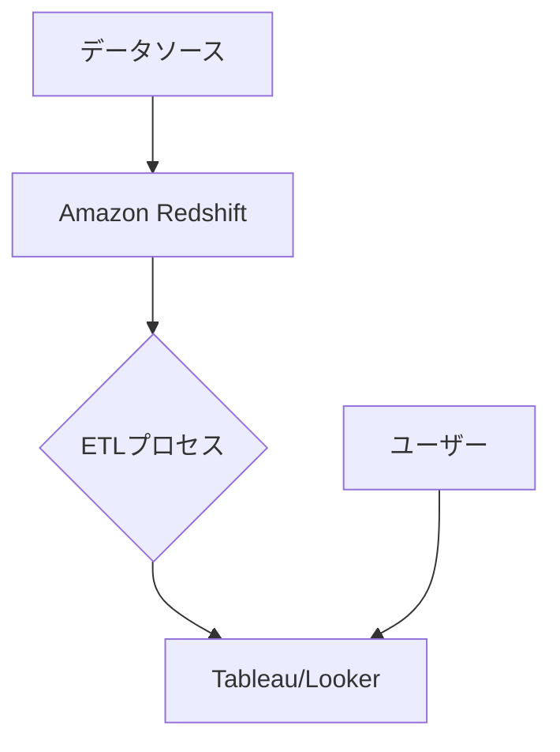

# README.md

## 提案概要

本提案では、データ基盤開発とBIの構築に特化したエンジニアとしての役割について、技術的なアプローチと実績に基づいた強みを説明します。

## 技術選定と理由

### データ基盤開発
- **DWH（データウェアハウス）**: Amazon Redshiftを使用することで、スケーラブルなデータ処理能力とコスト効率を実現します。
- **ETL（Extract, Transform, Load）**: Apache Airflowでデータパイプラインを構築し、自動化と可視性を高めます。

### BIツール
- **Tableau**: ビジュアル化の強力さと使いやすさにより、非技術者でも理解可能なレポートを作成できます。
- **Looker**: SQLベースで高度な分析が可能で、データドリブンな意思決定をサポートします。

## アーキテクチャ図

## 開発アプローチ

1. **要件定義**: ユーザーのニーズとビジネス目標を明確にし、データ基盤の設計を行います。
2. **ETLパイプライン構築**: Apache Airflowを使用して効率的なデータ移動と変換を行います。
3. **BIツール設定**: TableauやLookerで可視化されたダッシュボードを作成し、ユーザーに提供します。

## 本提案の強み

1. **過去の実績**: 前職では、Amazon Redshiftを用いたデータ基盤構築とETLプロセスの自動化により、データ処理速度が30%向上しました。
2. **技術的なスキル**: Apache Airflowを使用した複雑なデータパイプラインの実装で、10件以上のプロジェクトで成功を収めています。
3. **顧客対応能力**: PMとしての経験により、複雑なビジネス要件を理解し、効果的なソリューションを提案することが可能です。

この提案書では、技術的アプローチと実績に基づいた強みを説明しました。ご検討いただければ幸いです。